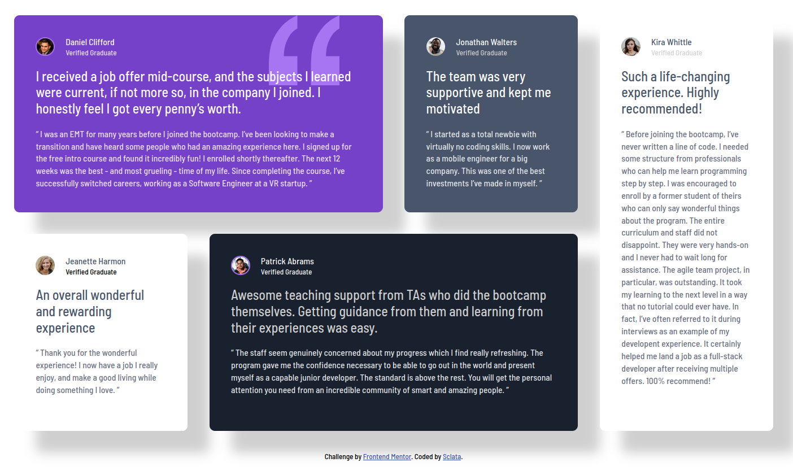
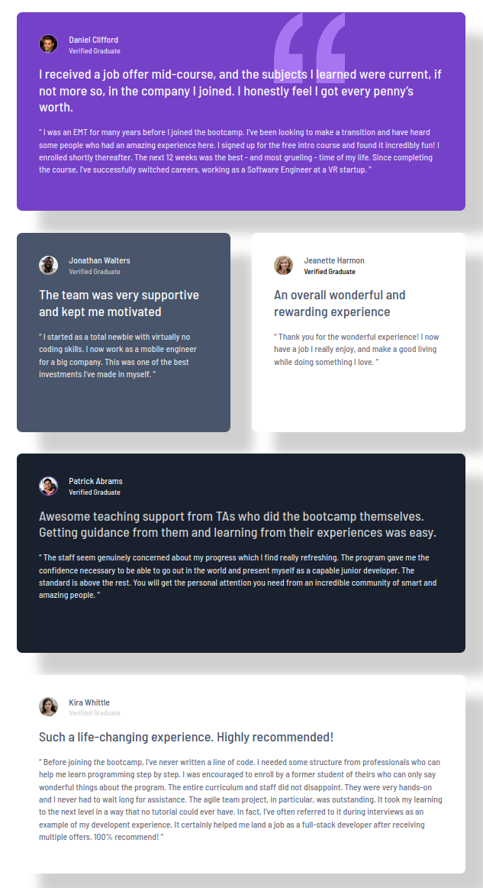
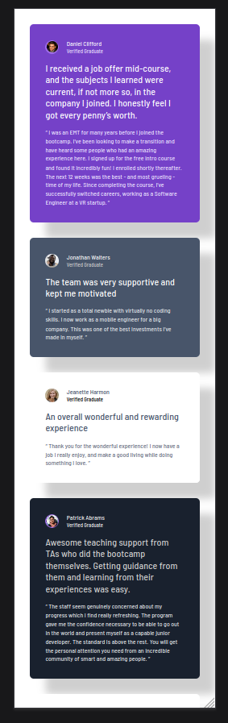

# Frontend Mentor - Testimonials grid section solution

This is a solution to the [Testimonials grid section challenge on Frontend Mentor](https://www.frontendmentor.io/challenges/testimonials-grid-section-Nnw6J7Un7). Frontend Mentor challenges help you improve your coding skills by building realistic projects. 

## Table of contents

- [Overview](#overview)
  - [The challenge](#the-challenge)
  - [Screenshots](#screenshots)
    - [Desktop](#desktop)
    - [Tablet](#tablet)
    - [Mobile](#mobile)
  - [Links](#links)
- [My process](#my-process)
  - [Built with](#built-with)
  - [What I learned](#what-i-learned)
  - [Continued development](#continued-development)
  - [Useful resources](#useful-resources)
- [Author](#author)
- [Acknowledgments](#acknowledgments)

## Overview

### The challenge

Users should be able to:

- View the optimal layout for the site depending on their device's screen size

### Screenshots

#### DESKTOP

#### TABLET

#### MOBILE

### Links

- [Solution URL](https://https://github.com/Sclata/testimonials-grid-section)
- [Live Site URL](https://sclata.github.io/testimonials-grid-section/src/index.html)

## My process

### Built with

- Semantic HTML5 markup
- Flexbox
- CSS Grid
- Mobile-first workflow
- SCSS
- BEM

### What I learned

Better refined my understanding of Grid. This was also the first project I felt really comfortable doing (using only HTML & vanilla CSS...I will visit JS on the associated FrontEndMentor learning path). I felt like I had a plan of attack and a roadmap or strategy to get the solution working in minimal time. I could look at different elements or components and felt like I intuitively knew when to leverage different properties and layout modes to achieve the desired look. 

The only thing that stumped me for a bit was the quotation SVG that appears in the backdrop of the first testimonial card. It was my first time using z-index. I needed to pull the sunmmary text in front of the image. Setting a negative z-index value on the quote pushed it entirely behind the card, so I set an index of "1" on the summary text and it worked. I attempted to specify this property in the SCSS file for the card component, but the quotation image remained on top, so I moved it to the layout partial where the positioning of the svg was specified and it did. Not sure why, but I'm guessing it has something to do with the order of the cascade in the processed stylesheet. Will have to investigate more later.

### Continued development

Looking forward to working with JS. I'm itching to start building in frameworks, but I want to make sure I have a good foundation first, so I'm intentionally trying to rely solely on introduced topics via the learning paths and resources related to those topics...namely vanilla CSS and methodologies not explicitly reliant on component-driven frameworks.

I hope as I dig deeper, I can answer some of my own questions about the dynamicity of certain elements. For example, in this particular project, I explicitly filled the grid, and the content was preloaded into the HTML file. However, this seems like a use case where you'd probably get a return of testimonials from a database (with filters set on the query to return positive reviews :D) and wouldn't be guaranteed their length or structure. Being able to render them correctly and assign grid areas based on content length would likely be where JS comes in. Anyhow, will investigate more later.

### Useful resources

I used two resources while completing this project:

1. Mozilla Developer Network (MDN) [language reference](https://developer.mozilla.org/en-US/docs/Web/CSS) for CSS.
2. [CSS: The Definitive Guide, 5th Edition](https://www.amazon.com/CSS-Definitive-Guide-Eric-Meyer-ebook/dp/B0C6NN4922) (OReilly) by [Eric Meyer](https://meyerweb.com/) and [Estelle Weyl](https://estelle.github.io/)

As an aside, if in the US, check with your local library to see if they are part of a network of libraries that offer access to OReilly's online platform and its courses, books, and more for free! I am NOT a paid spokesperson and am not in any way affiliated with OReilly, but I do like much of what they produce and have used other resources of theirs in the past. 

## Author

- Frontend Mentor - [Sclata](https://www.frontendmentor.io/profile/Sclata)

## Acknowledgments

Thanks to FEM in general for this project and to its designers/authors in particular. The whole platform is indespendible for learning the skill of front-end development. Also, thank you to the authors linked above in the resources section for their book, which I'm sure will continue to serve as a reference as I move forward on this journey.
